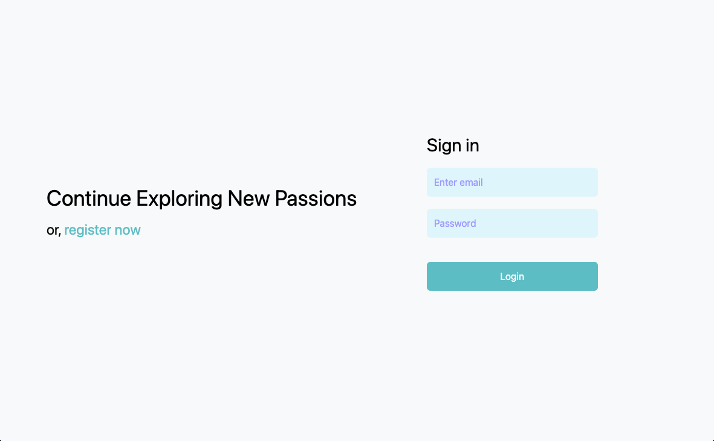
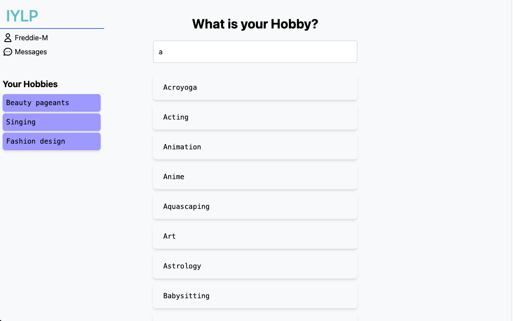

# If You Like Pina Coladas

## Inspiration ❗
The motivation behind this app was for the most part that I had some spare time and was trying to explore new hobbies as well as pursue my current ones, and so I thought that there should be a platform that allows people to connect with others who share similair hobbies. The name is a reference to the 1979 song Escape by Rupert Holmes.

## What it does 💭
If You Like Piña Coladas(IYLP) allows users to register, login, search for a hobby from a large selection of different hobbies, and then connect with others by making posts in various forums inside of the respective hobby home page. 

## How I built it ❓
This app was built using a Next.JS frontend with a Node backend supported by a Neo4j database. The hobbies were collected using a seperate webscaper python script which pulled all the hobbies from wikepedia.

## Challenges 😣

## What I learned 🧠

